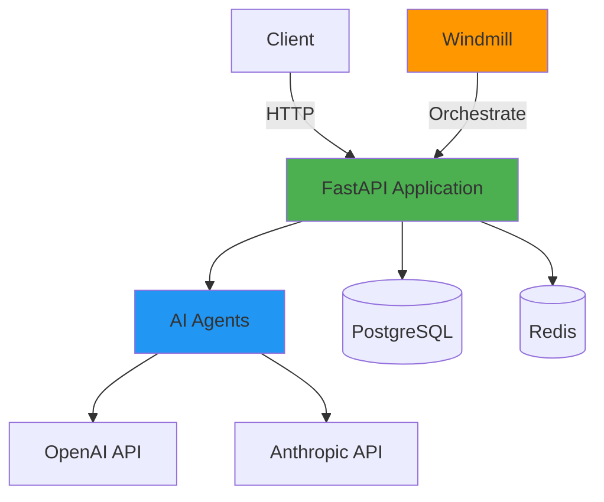

# Quick Start Guide

## 🚀 Getting Started in 5 Minutes

This guide will help you get the AI Agent Application running quickly.

## Prerequisites Check

Before starting, ensure you have:

```bash
# Check Docker
docker --version
# Should show: Docker version 20.10+

# Check Docker Compose
docker compose version
# Should show: Docker Compose version v2.0+

# Check Python (for local development)
python --version
# Should show: Python 3.11+
```

## Step 1: Clone and Setup

```bash
# Clone the repository
git clone https://github.com/KevinOBytes/example-app-template.git
cd example-app-template

# Copy environment template
cp .env.example .env
```

## Step 2: Configure Environment

Edit `.env` file and add your API keys:

```bash
# Minimal required configuration
OPENAI_API_KEY=sk-your-key-here
APP_ENV=development
APP_DEBUG=true
```

## Step 3: Start the Application

```bash
# Start all services
docker compose up -d

# View logs
docker compose logs -f app
```

## Step 4: Verify Installation

```bash
# Check health
curl http://localhost:8000/health

# Expected response:
# {
#   "status": "healthy",
#   "timestamp": "2024-01-13T18:00:00Z",
#   "environment": "development"
# }

# Test agent execution
curl -X POST http://localhost:8000/api/v1/agent/execute \
  -H "Content-Type: application/json" \
  -d '{"task": "Hello World"}'
```

## Step 5: Explore

- **API Documentation**: http://localhost:8000/docs
- **Windmill UI**: http://localhost:8080
- **Application**: http://localhost:8000

## Common Commands

```bash
# Stop services
docker compose down

# Restart services
docker compose restart

# View logs for specific service
docker compose logs -f app
docker compose logs -f postgres
docker compose logs -f redis

# Execute command in container
docker compose exec app bash

# Rebuild after code changes
docker compose up -d --build
```

## Next Steps

1. ✅ Read [INSTRUCTIONS.md](INSTRUCTIONS.md) for detailed development guide
2. ✅ Review [docs/architecture.md](docs/architecture.md) for system architecture
3. ✅ Check [docs/api-reference.md](docs/api-reference.md) for API documentation
4. ✅ Explore [docs/windmill-integration.md](docs/windmill-integration.md) for workflows
5. ✅ See [CLAUDE.md](CLAUDE.md) or [.github/copilot-instructions.md](.github/copilot-instructions.md) for AI assistant guidance

## Troubleshooting

### Port already in use

```bash
# Check what's using port 8000
lsof -i :8000

# Change port in .env
APP_PORT=8001
```

### Docker build fails

```bash
# Clean and rebuild
docker compose down -v
docker compose build --no-cache
docker compose up -d
```

### Database connection errors

```bash
# Check if PostgreSQL is running
docker compose ps postgres

# Restart database
docker compose restart postgres
```

### Module import errors

```bash
# Rebuild the container
docker compose up -d --build app
```

## Project Structure Overview

```
example-app-template/
├── 📄 README.md                    # Main documentation
├── 📄 INSTRUCTIONS.md              # Developer guide
├── 📄 CLAUDE.md                    # AI assistant context
├── 🐳 Dockerfile                   # Container definition
├── 🐳 docker-compose.yml           # Multi-service setup
├── 📝 .env.example                 # Configuration template
├── 
├── 📁 src/                         # Application source code
│   ├── main.py                    # FastAPI entry point
│   ├── config.py                  # Configuration
│   ├── agents/                    # AI agent implementations
│   ├── api/                       # API routes
│   ├── models/                    # Data models
│   └── utils/                     # Utilities
├── 
├── 📁 docs/                        # Documentation
│   ├── architecture.md            # System architecture
│   ├── api-reference.md           # API documentation
│   └── windmill-integration.md    # Windmill guide
├── 
├── 📁 tests/                       # Test suite
│   └── test_agents.py             # Agent tests
├── 
└── 📁 .github/                     # GitHub configuration
    └── copilot-instructions.md    # Copilot guidance
```

## Development Workflow

### Local Development

```bash
# 1. Create virtual environment
python -m venv venv
source venv/bin/activate  # Windows: venv\Scripts\activate

# 2. Install dependencies
pip install -r requirements.txt

# 3. Run the application
python src/main.py

# 4. Run tests
pytest
```

### Docker Development

```bash
# 1. Make code changes
# 2. Rebuild and restart
docker compose up -d --build

# 3. Run tests in container
docker compose exec app pytest
```

## Creating Your First Agent

```python
# src/agents/my_agent.py
from src.agents.base_agent import BaseAgent
from typing import Dict, Any, Optional

class MyAgent(BaseAgent):
    def __init__(self, **kwargs):
        super().__init__(name="my-agent", **kwargs)
    
    async def execute(self, task: str, context: Optional[Dict[str, Any]] = None) -> Dict[str, Any]:
        # Your agent logic here
        return {
            "status": "success",
            "response": f"Processed: {task}"
        }
```

Register in `src/agents/__init__.py`:
```python
from src.agents.my_agent import MyAgent
```

Add endpoint in `src/api/routes.py`:
```python
@router.post("/my-agent/execute")
async def execute_my_agent(request: AgentTaskRequest):
    agent = MyAgent()
    result = await agent.execute(request.task)
    return {"status": "success", "result": result}
```

## Architecture Diagram



## Key Features

- ✨ **Fast Development**: Pre-configured template ready to use
- 🤖 **AI-Ready**: Integration with OpenAI, Anthropic, Google AI
- 🐳 **Docker-First**: Complete containerized environment
- 🔄 **Windmill**: Workflow orchestration out of the box
- 📊 **Database**: PostgreSQL and Redis included
- 📝 **Well-Documented**: Comprehensive documentation and examples
- 🧪 **Tested**: Test suite included
- 🔐 **Secure**: Best practices for secrets and configuration

## Support and Resources

- 📖 **Documentation**: See `/docs` directory
- 🐛 **Issues**: Open an issue on GitHub
- 💬 **Discussions**: Use GitHub Discussions
- 📧 **Contact**: Check repository for contact info

---

**Happy Building! 🚀**
