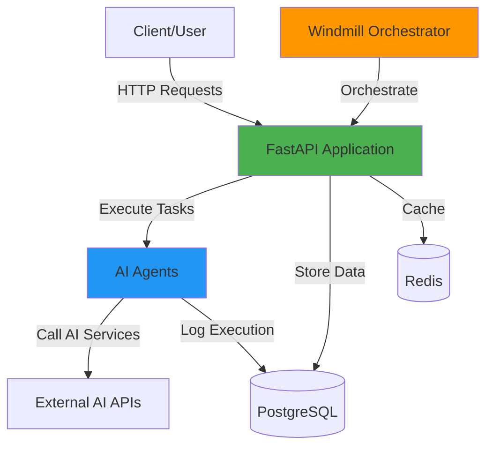

# AI Agent Application Template

A comprehensive, production-ready template for building AI agent applications with Docker, Windmill, and Python.

## 🚀 Features

- **🤖 AI Agent Framework**: Extensible base classes for creating custom AI agents
- **🐳 Docker Ready**: Fully containerized with Docker Compose orchestration
- **⚡ FastAPI Backend**: High-performance async API with automatic OpenAPI documentation
- **🔄 Windmill Integration**: Built-in workflow orchestration and automation
- **📊 PostgreSQL & Redis**: Database and caching layer included
- **🔐 Security First**: Environment-based configuration, non-root containers, health checks
- **📝 Comprehensive Docs**: Full documentation including AI assistant instructions
- **🎯 Type Safe**: Full type hints and Pydantic validation throughout

## 📋 Table of Contents

- [Quick Start](#quick-start)
- [Architecture](#architecture)
- [Project Structure](#project-structure)
- [Configuration](#configuration)
- [Development](#development)
- [API Documentation](#api-documentation)
- [Creating Custom Agents](#creating-custom-agents)
- [Windmill Integration](#windmill-integration)
- [Deployment](#deployment)
- [Contributing](#contributing)
- [License](#license)

## ⚡ Quick Start

### Prerequisites

- Docker 20.10+
- Docker Compose 2.0+
- Python 3.11+ (for local development)
- Git

### Installation

1. **Clone the repository**
   ```bash
   git clone https://github.com/KevinOBytes/example-app-template.git
   cd example-app-template
   ```

2. **Configure environment**
   ```bash
   cp .env.example .env
   # Edit .env and add your API keys
   ```

3. **Start the application**
   ```bash
   docker-compose up -d
   ```

4. **Verify it's running**
   ```bash
   curl http://localhost:8000/health
   ```

### Access Points

- **Main API**: http://localhost:8000
- **API Docs**: http://localhost:8000/docs (Swagger UI)
- **ReDoc**: http://localhost:8000/redoc
- **Windmill**: http://localhost:8080

## 🏗️ Architecture



See [Architecture Documentation](docs/architecture.md) for detailed information.

## 📁 Project Structure

```
example-app-template/
├── .github/
│   └── copilot-instructions.md    # GitHub Copilot AI guidance
├── docs/
│   ├── architecture.md            # Architecture documentation
│   └── api-reference.md           # API reference guide
├── src/
│   ├── __init__.py
│   ├── main.py                    # Application entry point
│   ├── config.py                  # Configuration management
│   ├── agents/
│   │   ├── __init__.py
│   │   ├── base_agent.py          # Abstract agent base class
│   │   └── sample_agent.py        # Example agent implementation
│   ├── api/
│   │   ├── __init__.py
│   │   └── routes.py              # API route definitions
│   ├── models/
│   │   └── __init__.py            # Pydantic models
│   └── utils/
│       └── __init__.py            # Utility functions
├── .env.example                   # Environment variables template
├── .gitignore                     # Git ignore rules
├── CLAUDE.md                      # Claude AI assistant instructions
├── docker-compose.yml             # Docker Compose configuration
├── Dockerfile                     # Container image definition
├── INSTRUCTIONS.md                # Developer instructions
├── LICENSE                        # MIT License
├── README.md                      # This file
└── requirements.txt               # Python dependencies
```

## ⚙️ Configuration

### Environment Variables

Key configuration options (see `.env.example` for complete list):

| Variable | Description | Default |
|----------|-------------|---------|
| `APP_ENV` | Environment (development/production) | `development` |
| `APP_PORT` | Application port | `8000` |
| `APP_DEBUG` | Enable debug mode | `true` |
| `OPENAI_API_KEY` | OpenAI API key | - |
| `ANTHROPIC_API_KEY` | Anthropic API key | - |
| `DATABASE_URL` | PostgreSQL connection string | - |
| `REDIS_URL` | Redis connection string | - |
| `AGENT_MODEL` | Default AI model | `gpt-4` |
| `AGENT_TEMPERATURE` | Model temperature | `0.7` |

### Configuration Files

- **`.env`**: Local environment variables (not committed)
- **`.env.example`**: Template with all available variables
- **`src/config.py`**: Type-safe configuration class

## 💻 Development

### Local Development (Without Docker)

1. **Create virtual environment**
   ```bash
   python -m venv venv
   source venv/bin/activate  # Windows: venv\Scripts\activate
   ```

2. **Install dependencies**
   ```bash
   pip install -r requirements.txt
   ```

3. **Run the application**
   ```bash
   python src/main.py
   ```

### Docker Development

1. **Build and start**
   ```bash
   docker-compose up --build
   ```

2. **View logs**
   ```bash
   docker-compose logs -f app
   ```

3. **Execute commands in container**
   ```bash
   docker-compose exec app bash
   ```

4. **Run tests**
   ```bash
   docker-compose exec app pytest
   ```

### Development Tools

- **Code Formatting**: `black src/`
- **Linting**: `ruff check src/`
- **Type Checking**: `mypy src/`
- **Testing**: `pytest`

## 📚 API Documentation

### Available Endpoints

#### Health & Info
- `GET /` - Root endpoint
- `GET /health` - Health check
- `GET /info` - Application information

#### Agent Operations
- `POST /api/v1/agent/execute` - Execute agent task
- `GET /api/v1/agent/history` - Get execution history
- `POST /api/v1/agent/analyze` - Analyze data
- `POST /api/v1/agent/generate` - Generate content

### Example Request

```bash
curl -X POST http://localhost:8000/api/v1/agent/execute \
  -H "Content-Type: application/json" \
  -d '{
    "task": "Analyze this text and provide insights",
    "context": {
      "source": "user_input"
    }
  }'
```

### Response Format

```json
{
  "status": "success",
  "result": {
    "status": "success",
    "task": "Analyze this text...",
    "response": "Analysis complete",
    "timestamp": "2024-01-13T18:00:00Z"
  }
}
```

## 🤖 Creating Custom Agents

### Step 1: Create Agent Class

Create a new file `src/agents/my_agent.py`:

```python
from src.agents.base_agent import BaseAgent
from typing import Dict, Any, Optional

class MyCustomAgent(BaseAgent):
    def __init__(self, **kwargs):
        super().__init__(name="my-custom-agent", **kwargs)
    
    async def execute(self, task: str, context: Optional[Dict[str, Any]] = None) -> Dict[str, Any]:
        # Your agent logic here
        result = {
            "status": "success",
            "response": f"Processed: {task}"
        }
        return result
```

### Step 2: Register Agent

Add to `src/agents/__init__.py`:
```python
from src.agents.my_agent import MyCustomAgent
```

### Step 3: Add API Endpoint

Update `src/api/routes.py`:
```python
@router.post("/my-agent/execute")
async def execute_my_agent(request: AgentTaskRequest):
    agent = MyCustomAgent()
    result = await agent.execute(request.task, request.context)
    return {"status": "success", "result": result}
```

## 🔄 Windmill Integration

Windmill provides workflow orchestration for complex agent interactions.

### Access Windmill UI

Navigate to http://localhost:8080 and create workflows that call your agents.

### Example Windmill Script

```python
import requests

def main(task_description: str):
    """Execute agent task via API."""
    response = requests.post(
        "http://app:8000/api/v1/agent/execute",
        json={"task": task_description}
    )
    return response.json()
```

## 🚀 Deployment

### Docker Production Deployment

1. **Set production environment**
   ```bash
   export APP_ENV=production
   export APP_DEBUG=false
   ```

2. **Update docker-compose for production**
   ```yaml
   # Use production configurations
   # Add volume mounts for persistent data
   # Configure proper networking
   ```

3. **Deploy**
   ```bash
   docker-compose -f docker-compose.prod.yml up -d
   ```

### Health Monitoring

Monitor application health via:
- `/health` endpoint
- Docker health checks
- Application logs
- Prometheus metrics (if configured)

### Scaling

Scale the application using Docker Compose:
```bash
docker-compose up -d --scale app=3
```

Or deploy to Kubernetes for advanced orchestration.

## 🧪 Testing

### Run Tests

```bash
# All tests
pytest

# With coverage
pytest --cov=src --cov-report=html

# Specific test file
pytest tests/test_agents.py

# Watch mode
pytest-watch
```

### Test Structure

```python
import pytest
from src.agents.sample_agent import SampleAgent

@pytest.mark.asyncio
async def test_agent_execution():
    agent = SampleAgent()
    result = await agent.execute("test task")
    assert result["status"] == "success"
```

## 🤝 Contributing

Contributions are welcome! Please follow these guidelines:

1. Fork the repository
2. Create a feature branch (`git checkout -b feature/amazing-feature`)
3. Follow the code style (PEP 8, type hints, docstrings)
4. Write tests for new functionality
5. Update documentation as needed
6. Commit changes (`git commit -m 'Add amazing feature'`)
7. Push to branch (`git push origin feature/amazing-feature`)
8. Open a Pull Request

See [INSTRUCTIONS.md](INSTRUCTIONS.md) for detailed development guidelines.

## 📖 Additional Documentation

- **[INSTRUCTIONS.md](INSTRUCTIONS.md)**: Comprehensive developer guide
- **[CLAUDE.md](CLAUDE.md)**: Claude AI assistant context and guidelines
- **[.github/copilot-instructions.md](.github/copilot-instructions.md)**: GitHub Copilot guidance
- **[docs/architecture.md](docs/architecture.md)**: Detailed architecture documentation
- **[docs/api-reference.md](docs/api-reference.md)**: Complete API reference

## 🔒 Security

- Never commit `.env` files or secrets
- Use environment variables for all sensitive data
- Keep dependencies updated
- Review security advisories regularly
- Use HTTPS in production
- Implement rate limiting for public endpoints

## 📝 License

This project is licensed under the MIT License - see the [LICENSE](LICENSE) file for details.

## 🙏 Acknowledgments

- FastAPI for the excellent web framework
- Windmill for workflow orchestration
- Docker for containerization
- The open-source community

## 📧 Support

For questions, issues, or suggestions:
- Open an issue on GitHub
- Check existing documentation
- Review the troubleshooting section in INSTRUCTIONS.md

---

**Built with ❤️ for AI Agent Development**
