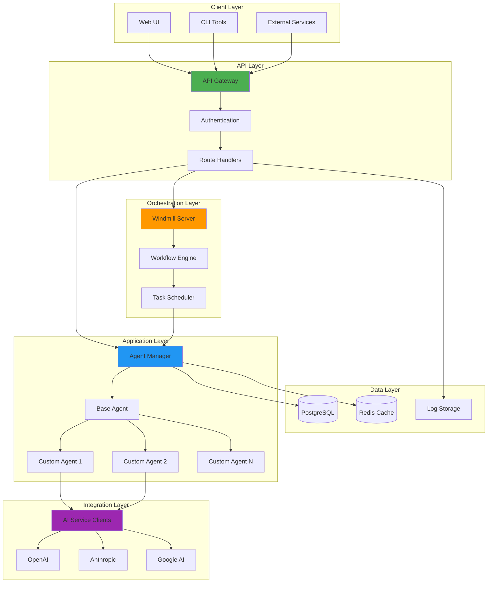
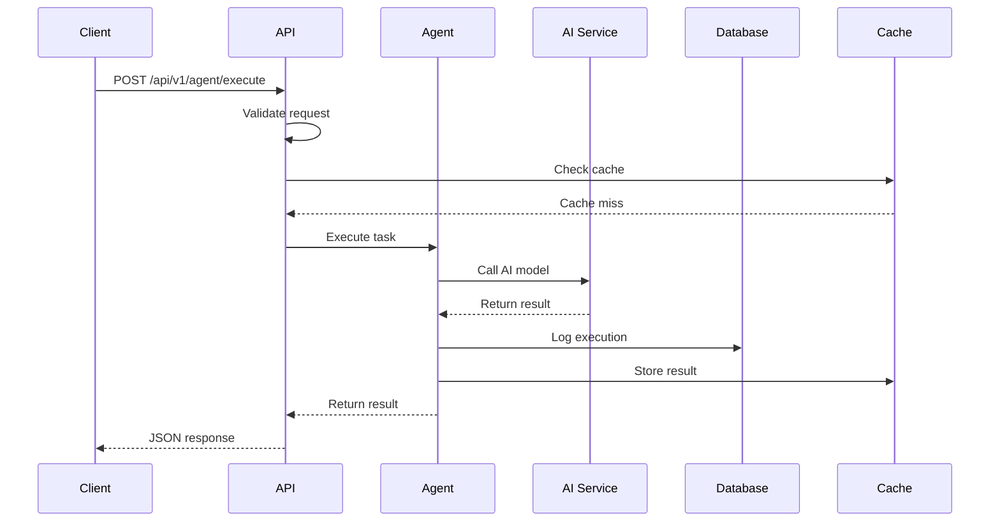
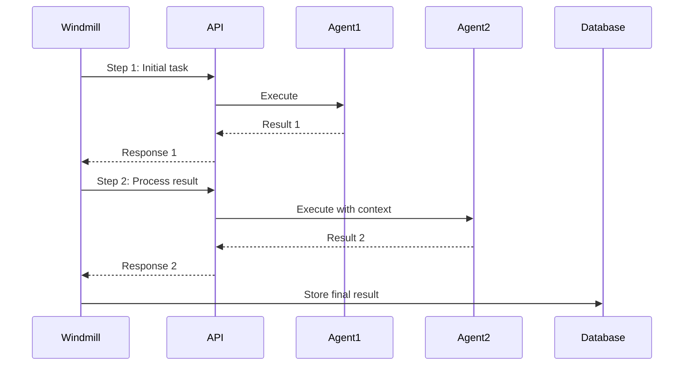
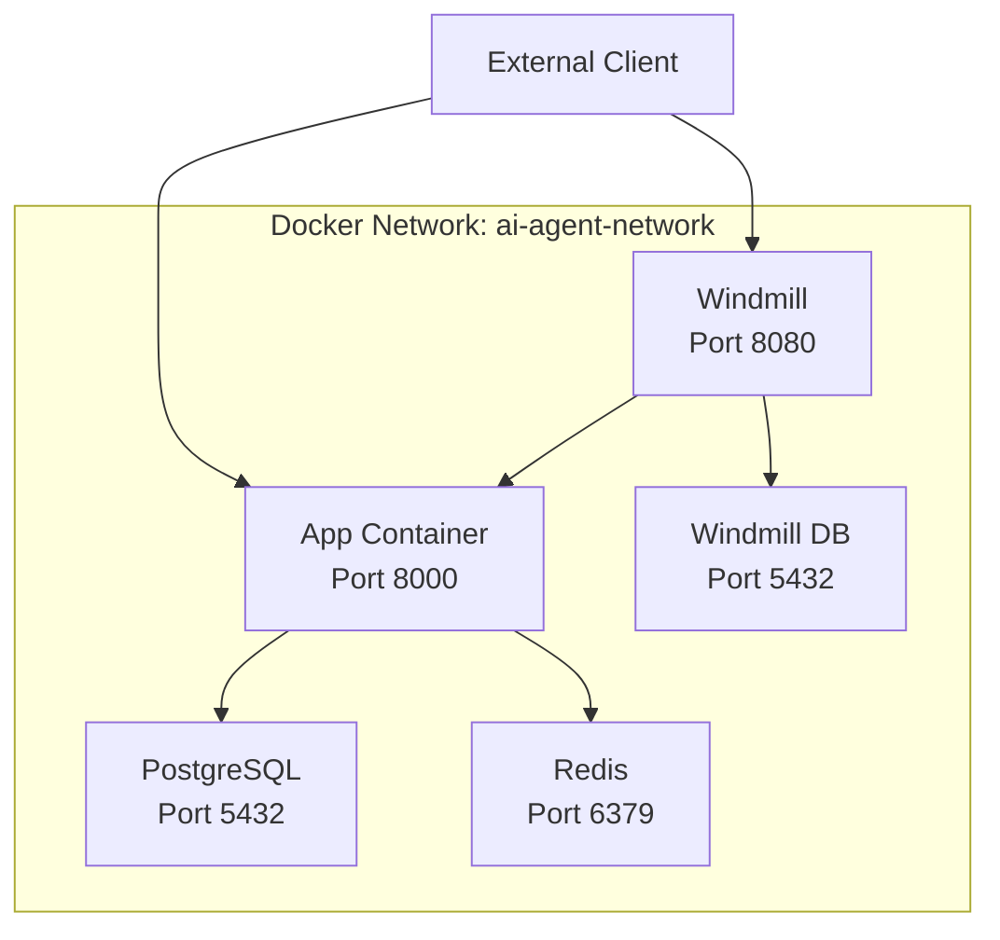
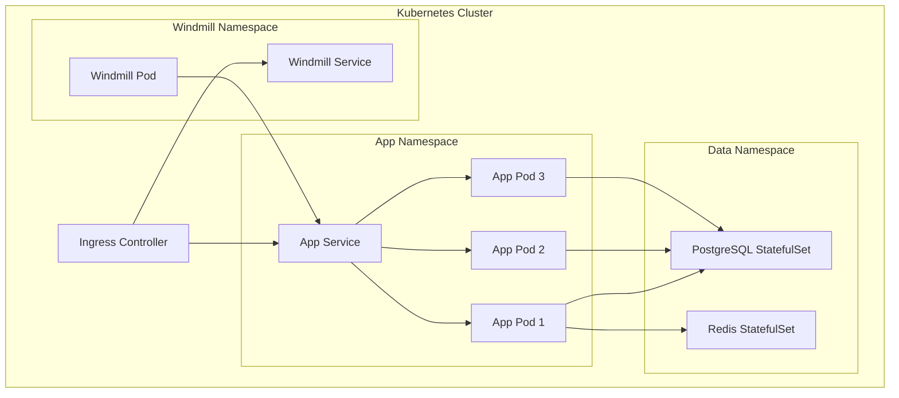
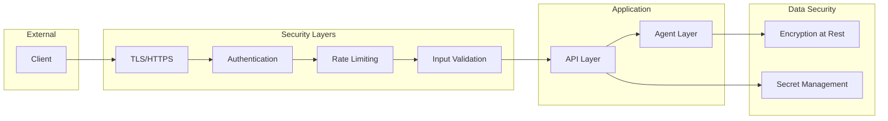
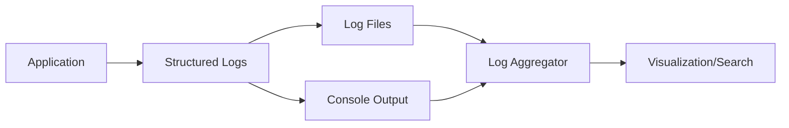

# Architecture Documentation

## Overview

The AI Agent Application Template is designed as a modular, scalable platform for building and deploying AI-powered agent systems. The architecture emphasizes separation of concerns, extensibility, and production-readiness.

## System Architecture

### High-Level Architecture



## Component Details

### 1. API Layer

**Technology**: FastAPI

**Responsibilities**:
- HTTP request/response handling
- Request validation via Pydantic
- Authentication and authorization
- Rate limiting
- API documentation (OpenAPI/Swagger)

**Key Files**:
- `src/main.py`: Application initialization
- `src/api/routes.py`: Route definitions
- `src/models/`: Request/response models

### 2. Agent Layer

**Pattern**: Abstract Base Class with concrete implementations

**Responsibilities**:
- Task execution logic
- State management
- Execution history tracking
- Error handling and recovery

**Key Components**:

#### Base Agent
```python
class BaseAgent(ABC):
    - execute(task, context) -> result
    - log_execution(task, result, duration)
    - get_execution_history()
```

#### Custom Agents
- Inherit from BaseAgent
- Implement specific AI capabilities
- Can be composed for complex workflows

**Key Files**:
- `src/agents/base_agent.py`: Abstract base class
- `src/agents/sample_agent.py`: Example implementation
- `src/agents/`: Additional agent implementations

### 3. Configuration Layer

**Technology**: Pydantic Settings

**Responsibilities**:
- Environment variable management
- Type-safe configuration
- Default values and validation
- Secret management

**Key Files**:
- `src/config.py`: Settings class
- `.env`: Local configuration (not committed)
- `.env.example`: Configuration template

### 4. Integration Layer

**Purpose**: Connect to external AI services

**Supported Integrations**:
- OpenAI (GPT models)
- Anthropic (Claude models)
- Google AI
- Custom integrations

**Pattern**: Client adapters for each service

### 5. Orchestration Layer (Windmill)

**Technology**: Windmill

**Responsibilities**:
- Workflow definition and execution
- Task scheduling
- Event-driven automation
- Multi-step agent coordination

**Integration Points**:
- Calls application API endpoints
- Manages complex workflows
- Provides UI for workflow management

### 6. Data Layer

#### PostgreSQL
**Purpose**: Persistent data storage

**Schema**:
- Agent execution records
- User data
- Task history
- Configuration data

#### Redis
**Purpose**: Caching and temporary data

**Use Cases**:
- Session storage
- Rate limiting counters
- Temporary computation results
- Job queues

## Data Flow

### Request Processing Flow



### Windmill Workflow Flow



## Deployment Architecture

### Docker Compose (Development/Small Scale)



### Production Deployment (Kubernetes)



## Security Architecture

### Security Layers



### Security Best Practices

1. **Authentication & Authorization**
   - JWT tokens for API authentication
   - Role-based access control (RBAC)
   - API key management

2. **Data Protection**
   - Environment variables for secrets
   - Encryption at rest for sensitive data
   - TLS for data in transit

3. **Container Security**
   - Non-root user execution
   - Minimal base images
   - Regular security updates

4. **Input Validation**
   - Pydantic model validation
   - SQL injection prevention
   - XSS protection

## Scalability Considerations

### Horizontal Scaling

The application is designed to be stateless, allowing horizontal scaling:

1. **Stateless Design**
   - No local state in application containers
   - Session data in Redis
   - Database connection pooling

2. **Load Balancing**
   - Distribute requests across instances
   - Health check-based routing
   - Session affinity if needed

3. **Caching Strategy**
   - Redis for shared cache
   - Cache-aside pattern
   - TTL-based invalidation

### Performance Optimization

1. **Async Operations**
   - FastAPI async endpoints
   - Async database queries
   - Concurrent agent execution

2. **Connection Pooling**
   - PostgreSQL connection pool
   - Redis connection pool
   - HTTP client connection reuse

3. **Monitoring**
   - Prometheus metrics
   - Health check endpoints
   - Execution time tracking

## Extensibility Points

### Adding New Agents

1. Inherit from `BaseAgent`
2. Implement `execute()` method
3. Register in agents package
4. Add API endpoints

### Adding New Integrations

1. Create client adapter
2. Add configuration options
3. Implement error handling
4. Add to agent implementations

### Adding New Workflows

1. Define in Windmill UI
2. Use API endpoints
3. Chain multiple agents
4. Handle errors and retries

## Monitoring and Observability

### Logging Strategy



### Metrics Collection

- Request counts and durations
- Agent execution metrics
- Database query performance
- Cache hit/miss ratios
- Error rates

### Health Checks

- `/health`: Basic health status
- `/info`: Application information
- Docker health checks
- Database connectivity checks

## Future Enhancements

1. **Advanced Agent Features**
   - Multi-agent collaboration
   - Agent memory and context
   - Learning from feedback

2. **Enhanced Monitoring**
   - Distributed tracing
   - Advanced metrics
   - Alerting system

3. **Additional Integrations**
   - More AI providers
   - Message queues (RabbitMQ, Kafka)
   - Vector databases for embeddings

4. **Improved Orchestration**
   - DAG-based workflows
   - Conditional execution
   - Parallel agent execution

## Conclusion

This architecture provides a solid foundation for building production-grade AI agent applications. It balances simplicity with extensibility, allowing developers to start quickly while providing the flexibility to scale and adapt to complex requirements.
