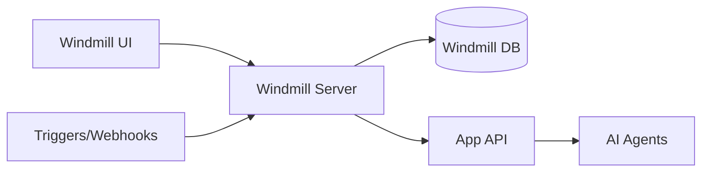

# Windmill Configuration and Integration Guide

## Overview

Windmill is an open-source workflow engine that allows you to orchestrate complex multi-step processes involving AI agents. This document explains how to integrate and use Windmill with the AI Agent Application.

## Architecture



## Access Windmill

- **URL**: http://localhost:8080
- **Default Workspace**: `default`
- **Connection from Windmill to App**: `http://app:8000` (Docker network)

## Creating Your First Workflow

### Step 1: Access Windmill UI

Navigate to http://localhost:8080 in your browser.

### Step 2: Create a New Flow

1. Click "Flows" in the sidebar
2. Click "New Flow"
3. Give it a name (e.g., "AI Agent Orchestration")

### Step 3: Add Python Script Steps

#### Example: Simple Agent Call

```python
import requests

def main(task_description: str):
    """
    Call the AI agent with a task.
    
    Args:
        task_description: The task to execute
    
    Returns:
        The agent's response
    """
    response = requests.post(
        "http://app:8000/api/v1/agent/execute",
        json={
            "task": task_description,
            "context": {
                "source": "windmill",
                "workflow": "simple_agent_call"
            }
        }
    )
    
    if response.status_code == 200:
        return response.json()
    else:
        raise Exception(f"Agent call failed: {response.text}")
```

#### Example: Multi-Step Workflow

```python
import requests

def analyze_step(data: str):
    """Step 1: Analyze the input data."""
    response = requests.post(
        "http://app:8000/api/v1/agent/analyze",
        json={"data": data}
    )
    return response.json()

def generate_step(analysis_result: dict):
    """Step 2: Generate content based on analysis."""
    prompt = f"Based on this analysis: {analysis_result}, generate a summary"
    response = requests.post(
        "http://app:8000/api/v1/agent/generate",
        json={"prompt": prompt}
    )
    return response.json()

def main(input_data: str):
    """
    Main workflow orchestrating multiple agent calls.
    """
    # Step 1: Analyze
    analysis = analyze_step(input_data)
    
    # Step 2: Generate
    generation = generate_step(analysis)
    
    # Return combined results
    return {
        "analysis": analysis,
        "generation": generation,
        "status": "completed"
    }
```

## Advanced Patterns

### Pattern 1: Conditional Execution

```python
def main(task_type: str, data: str):
    """
    Execute different agents based on task type.
    """
    if task_type == "analyze":
        return requests.post(
            "http://app:8000/api/v1/agent/analyze",
            json={"data": data}
        ).json()
    elif task_type == "generate":
        return requests.post(
            "http://app:8000/api/v1/agent/generate",
            json={"prompt": data}
        ).json()
    else:
        raise ValueError(f"Unknown task type: {task_type}")
```

### Pattern 2: Error Handling and Retries

```python
import requests
import time

def main(task: str, max_retries: int = 3):
    """
    Execute task with retry logic.
    """
    for attempt in range(max_retries):
        try:
            response = requests.post(
                "http://app:8000/api/v1/agent/execute",
                json={"task": task},
                timeout=30
            )
            
            if response.status_code == 200:
                return response.json()
            else:
                print(f"Attempt {attempt + 1} failed: {response.status_code}")
                
        except Exception as e:
            print(f"Attempt {attempt + 1} error: {str(e)}")
            
        if attempt < max_retries - 1:
            time.sleep(2 ** attempt)  # Exponential backoff
    
    raise Exception(f"Failed after {max_retries} attempts")
```

### Pattern 3: Parallel Agent Execution

```python
import requests
from concurrent.futures import ThreadPoolExecutor, as_completed

def execute_agent(task: str):
    """Execute a single agent task."""
    response = requests.post(
        "http://app:8000/api/v1/agent/execute",
        json={"task": task}
    )
    return response.json()

def main(tasks: list):
    """
    Execute multiple agent tasks in parallel.
    """
    results = []
    
    with ThreadPoolExecutor(max_workers=5) as executor:
        futures = {executor.submit(execute_agent, task): task for task in tasks}
        
        for future in as_completed(futures):
            task = futures[future]
            try:
                result = future.result()
                results.append({"task": task, "result": result})
            except Exception as e:
                results.append({"task": task, "error": str(e)})
    
    return results
```

## Scheduling Workflows

### Cron Schedule

Set up recurring workflows:

1. In Windmill UI, go to your flow
2. Click "Schedule"
3. Enter cron expression:
   - `0 * * * *` - Every hour
   - `0 9 * * *` - Daily at 9 AM
   - `0 0 * * 0` - Weekly on Sunday
   - `*/15 * * * *` - Every 15 minutes

### Webhook Triggers

Trigger workflows via HTTP:

1. Create a webhook in Windmill
2. Get the webhook URL
3. POST to the URL with JSON payload

```bash
curl -X POST https://windmill-url/api/w/workspace/webhooks/token \
  -H "Content-Type: application/json" \
  -d '{"input_data": "value"}'
```

## Environment Variables in Windmill

Access environment variables in your scripts:

```python
import os

def main():
    api_key = os.getenv("OPENAI_API_KEY")
    # Use the API key
```

Configure in Windmill:
1. Go to Workspace Settings
2. Add variables
3. Mark as secret if needed

## Windmill Resources

Store reusable resources like API clients:

```python
# Resource: app_api_client
{
    "base_url": "http://app:8000",
    "timeout": 30
}
```

Use in scripts:
```python
def main(app_api_client: dict):
    base_url = app_api_client["base_url"]
    # Make requests
```

## Monitoring and Logs

### View Execution Logs

1. Go to "Runs" in Windmill UI
2. Click on a run
3. View logs, inputs, and outputs

### Check App Logs

```bash
# View application logs
docker-compose logs -f app

# View Windmill logs
docker-compose logs -f windmill
```

## Best Practices

1. **Error Handling**: Always wrap API calls in try-except blocks
2. **Timeouts**: Set reasonable timeouts for agent calls
3. **Logging**: Use print statements for debugging in Windmill
4. **Retries**: Implement retry logic for transient failures
5. **Idempotency**: Design workflows to be safely retryable
6. **Testing**: Test scripts locally before deploying to Windmill
7. **Documentation**: Document workflow inputs and outputs

## Integration Examples

### Example 1: Daily Report Generation

```python
import requests
from datetime import datetime

def main():
    """
    Generate a daily report using AI agents.
    """
    # Get data to analyze
    data = fetch_daily_data()
    
    # Analyze with agent
    analysis = requests.post(
        "http://app:8000/api/v1/agent/analyze",
        json={"data": data}
    ).json()
    
    # Generate report
    report = requests.post(
        "http://app:8000/api/v1/agent/generate",
        json={"prompt": f"Create report: {analysis}"}
    ).json()
    
    # Send report (email, Slack, etc.)
    send_report(report)
    
    return {
        "timestamp": datetime.utcnow().isoformat(),
        "status": "completed"
    }
```

### Example 2: Event-Driven Processing

```python
def main(event: dict):
    """
    Process an event with AI agents.
    """
    event_type = event.get("type")
    event_data = event.get("data")
    
    # Route to appropriate agent
    result = requests.post(
        "http://app:8000/api/v1/agent/execute",
        json={
            "task": f"Process {event_type} event",
            "context": {
                "event": event_data,
                "timestamp": event.get("timestamp")
            }
        }
    ).json()
    
    return result
```

## Troubleshooting

### Connection Issues

If Windmill cannot reach the app:

1. Check Docker network: `docker network ls`
2. Verify containers are on same network: `docker network inspect ai-agent-network`
3. Use container name `app` not `localhost`

### Workflow Failures

1. Check Windmill run logs
2. Verify API endpoint is correct
3. Check application logs: `docker-compose logs app`
4. Test API manually: `curl http://localhost:8000/health`

### Performance Issues

1. Reduce parallel execution workers
2. Increase agent timeout settings
3. Optimize agent implementations
4. Use caching where appropriate

## Additional Resources

- [Windmill Documentation](https://docs.windmill.dev)
- [Windmill GitHub](https://github.com/windmill-labs/windmill)
- Application API Reference: `/docs/api-reference.md`

## Next Steps

1. Create your first workflow in Windmill
2. Test with simple agent calls
3. Build more complex multi-step workflows
4. Set up scheduling for recurring tasks
5. Monitor and optimize workflow performance
